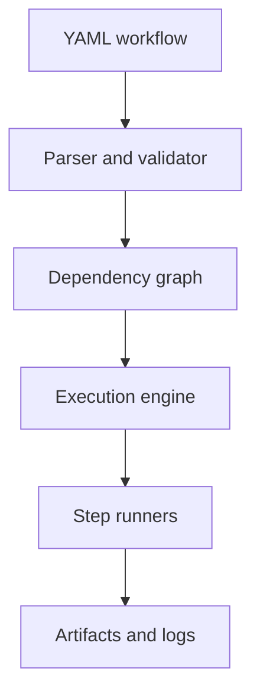

# engflow

A lightweight Python framework for defining, validating, and (soon) executing engineering and
scientific workflows — CFD/FEA pipelines, CAD/meshing, parameter sweeps, ML training, lab
automation, report generation — without adopting a full workflow platform.

**Status: pre-alpha (v0.1.0 in progress).** Schema validation and dependency-graph resolution
work today; the execution engine (`engflow run`) is the next milestone. See
[docs/vision.md](docs/vision.md) for full scope and non-goals.

## What problem does this solve?

Multi-step computational work is usually glued together with shell scripts or notebooks that
don't track what ran, in what order, with what inputs, or whether it can resume after a crash.
engflow defines that chain declaratively and validates it before anything runs.

## Who is it for?

Engineers and researchers running multi-step computational pipelines who currently manage them
with ad hoc scripts.

## What makes it different?

No cluster, no server, no cloud dependency. It runs on a laptop as easily as a CI runner, and
it doesn't assume any particular solver, industry, or file format.

## Install

```bash
git clone https://github.com/NicholasTJL/engflow.git
cd engflow
pip install -e .
```

## Minimal example

```yaml
# workflow.yaml
name: demo
steps:
  - id: generate
    uses: python
    entrypoint: mymodule:generate_data
  - id: process
    uses: command
    command: python process.py
    depends_on: [generate]
```

```bash
engflow validate workflow.yaml
engflow graph workflow.yaml
```

More in [examples/](examples/).

## Visual builder (engflow studio)

A drag-and-drop workflow builder backed by a real API — see [web/README.md](web/README.md).

```bash
pip install -e ".[api]" && uvicorn engflow.api.main:app --reload   # terminal 1
cd web && npm install && npm run dev                                # terminal 2
```

### Deploying to Vercel

The API and the frontend deploy as **two separate Vercel projects** from this one repo — a
Python serverless function doesn't share a build root with a Vite app, so don't try to deploy
both from a single project.

**API project:**

1. Import this repo in Vercel, set **Root Directory** to `.` (repo root).
2. Vercel auto-detects `api/index.py` (a thin re-export of `engflow.api.main:app`) and
   `requirements.txt` (`-e .` plus `fastapi`) — no other config needed.
3. Note the deployed URL (e.g. `https://engflow-api.vercel.app`).

**Web project:**

1. Import this repo again as a *second* Vercel project, set **Root Directory** to `web`.
2. Vercel auto-detects Vite. Add an environment variable `VITE_API_BASE` set to the API
   project's URL from step above.
3. Deploy.

On Vercel's free (Hobby) plan, both projects deploy to a single fixed region (`iad1`, US East)
regardless of your location — that's a plan limit, not a bug.

## Architecture



`engflow.core.parser` validates a workflow file against the `WorkflowDefinition` schema.
`engflow.core.graph` builds the dependency graph, detects cycles, and computes a valid
execution order. `engflow.core.executor` runs each step in that order, dispatching to a
`python` or `command` runner (`engflow.runners`), and records a `RunState` — per-step status,
timestamps, exit codes, and captured stdout/stderr — as `run_state.json` under the run
directory (`runs/<run-id>/` by default). Failed steps skip their dependents; other independent
steps still run.

```bash
engflow run examples/parameter_sweep/workflow.yaml
engflow status runs/<run-id>
```

## Roadmap

- [x] Workflow schema and YAML parsing
- [x] Dependency graph and cycle detection
- [x] Sequential execution engine (Python + command runners)
- [ ] Retries, timeouts, resume, concurrent execution, caching
- [ ] Plugin runner protocol, Docker/HTTP runners

Full roadmap: [docs/vision.md](docs/vision.md).

## Contributing

See [CONTRIBUTING.md](CONTRIBUTING.md). Issues labeled `good first issue` don't require
familiarity with the executor internals.

## License

[MIT](LICENSE)
