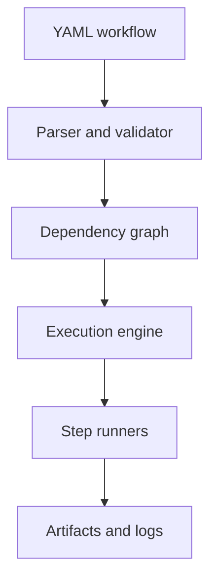

# engflow

A lightweight Python framework for defining, validating, and executing engineering and
scientific workflows — CFD/FEA pipelines, CAD/meshing, parameter sweeps, ML training, lab
automation, report generation — without adopting a full workflow platform.

**Status: v0.2.0.** Schema validation, dependency-graph resolution, and a concurrent execution
engine with retries, timeouts, and resume all work today. See [docs/vision.md](docs/vision.md)
for full scope and non-goals.

## What problem does this solve?

Multi-step computational work is usually glued together with shell scripts or notebooks that
don't track what ran, in what order, with what inputs, or whether it can resume after a crash.
engflow defines that chain declaratively and validates it before anything runs.

## Who is it for?

Engineers and researchers running multi-step computational pipelines who currently manage them
with ad hoc scripts.

## What makes it different?

No cluster, no server, no cloud dependency. It runs on a laptop as easily as a CI runner, and
it doesn't assume any particular solver, industry, or file format.

## Install

```bash
git clone https://github.com/NicholasTJL/engflow.git
cd engflow
pip install -e .
```

## Minimal example

```yaml
# workflow.yaml
name: demo
steps:
  - id: generate
    uses: python
    entrypoint: mymodule:generate_data
  - id: process
    uses: command
    command: python process.py
    depends_on: [generate]
```

```bash
engflow validate workflow.yaml
engflow graph workflow.yaml
```

More in [examples/](examples/).

## Visual builder (engflow studio)

A drag-and-drop workflow builder backed by a real API — see [web/README.md](web/README.md).

```bash
pip install -e ".[api]" && uvicorn engflow.api.main:app --reload   # terminal 1
cd web && npm install && npm run dev                                # terminal 2
```

### Deploying to Vercel

The API and the frontend deploy as **two separate Vercel projects** from this one repo — a
Python serverless function doesn't share a build root with a Vite app, so don't try to deploy
both from a single project.

**API project:**

1. Import this repo in Vercel, set **Root Directory** to `.` (repo root).
2. Vercel auto-detects `api/index.py` (a thin re-export of `engflow.api.main:app`) and
   `requirements.txt` (`-e .` plus `fastapi`) — no other config needed.
3. Note the deployed URL (e.g. `https://engflow-api.vercel.app`).

**Web project:**

1. Import this repo again as a *second* Vercel project, set **Root Directory** to `web`.
2. Vercel auto-detects Vite. Add an environment variable `VITE_API_BASE` set to the API
   project's URL from step above.
3. Deploy.

On Vercel's free (Hobby) plan, both projects deploy to a single fixed region (`iad1`, US East)
regardless of your location — that's a plan limit, not a bug.

## Architecture



`engflow.core.parser` validates a workflow file against the `WorkflowDefinition` schema.
`engflow.core.graph` builds the dependency graph, detects cycles, and computes a valid
execution order. `engflow.core.executor` runs steps concurrently as soon as their dependencies
have succeeded, dispatching to a `python` or `command` runner (`engflow.runners`), and records a
`RunState` — per-step status, timestamps, exit codes, attempt counts, and captured stdout/stderr
— as `run_state.json` under the run directory (`runs/<run-id>/` by default). A step whose
dependency failed or was skipped is itself marked skipped; other independent steps still run.

```bash
engflow run examples/parameter_sweep/workflow.yaml
engflow status runs/<run-id>
```

## Reliability features (v0.2.0)

**Retries.** Set `retries: N` on a step to retry it up to `N` times on failure, with exponential
backoff between attempts (1s, 2s, 4s, ...). `StepResult.attempts` records how many attempts it
took; `engflow run`/`status` show `(attempt N)` next to a step that needed more than one. Each
attempt reuses the same step workdir, so `stdout.log`/`stderr.log` hold only the *last*
attempt's output -- earlier failed attempts aren't preserved separately.

**Timeouts.** Set `timeout: N` (seconds) on a step to fail it if it runs longer than that.
`CommandRunner` enforces this by killing the step's whole process tree, not just the immediate
process — a shell script's own background children are killed too. `PythonRunner` enforces it by
running the target function in a background thread and giving up after `N` seconds; Python has
no safe way to force-kill a thread, so a timed-out function keeps running in the background,
detached, until it finishes or the process exits. That's a real limitation of the interpreter,
not an oversight — prefer `command` steps (which shell out to a real, killable process) for
anything you need a hard timeout to actually stop.

**Concurrent execution.** Steps with no unmet dependencies run at the same time, up to
`--max-concurrency` at once (default 4):

```bash
engflow run workflow.yaml --max-concurrency 8
```

**Resume.** `engflow run workflow.yaml --resume <run-dir>` continues a prior run in place: any
step that already succeeded there is skipped, and everything else (pending, failed, skipped, or
interrupted mid-run) runs normally. This only checks "did this step succeed in this exact run
directory last time" — it does not hash step inputs or detect that a step's command changed, so
it's meant for resuming after a crash or interruption, not as a general build cache.

**Environment variables and secret masking.** Set `env: {KEY: value}` on a `command` step to add
environment variables to the subprocess (on top of the inherited process environment); a
`python` step gets the same values via `context["env"]` instead of `os.environ`, since mutating
the real process environment isn't safe when steps run concurrently. Any value from an env var
whose name ends in `_KEY`, `_TOKEN`, `_SECRET`, or `_PASSWORD` (case-insensitive, at least 8
characters) is masked to `***MASKED***` everywhere it would otherwise appear in `stdout.log`,
`stderr.log`, or a step's recorded error message.

This is a safety net, not a guarantee: it matches on variable *name*, not on the shape of a
value, so a secret in a variable named `MY_VALUE` won't be masked, and it only catches the value
verbatim — base64-encoded, split-across-lines, or otherwise transformed secrets slip through.
Don't rely on it as your only safeguard for real credentials.

## Roadmap

- [x] Workflow schema and YAML parsing
- [x] Dependency graph and cycle detection
- [x] Concurrent execution engine (Python + command runners)
- [x] Retries with exponential backoff
- [x] Timeout enforcement (both runners) and process-tree termination
- [x] Secret masking in logs
- [x] Resume (skip steps that already succeeded in a run directory)
- [ ] SQLite run history and content-based caching
- [ ] Plugin runner protocol, Docker/HTTP runners

Full roadmap: [docs/vision.md](docs/vision.md).

## Contributing

See [CONTRIBUTING.md](CONTRIBUTING.md). Issues labeled `good first issue` don't require
familiarity with the executor internals.

## License

[MIT](LICENSE)
