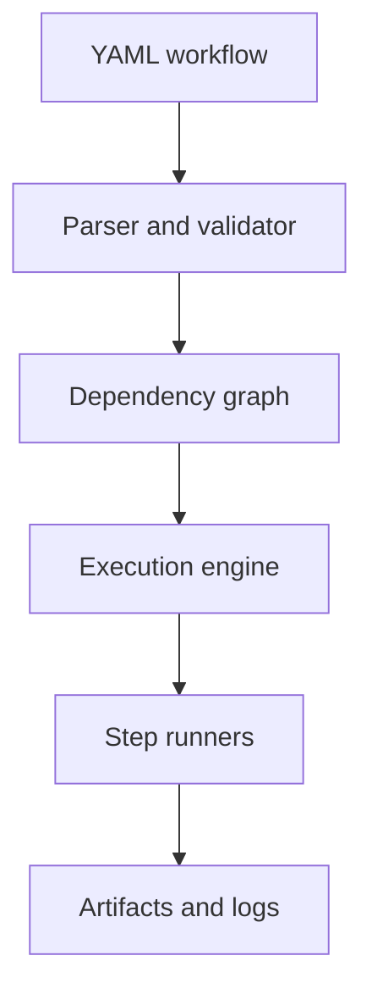

# engflow

A lightweight Python framework for defining, validating, and (soon) executing engineering and
scientific workflows — CFD/FEA pipelines, CAD/meshing, parameter sweeps, ML training, lab
automation, report generation — without adopting a full workflow platform.

**Status: pre-alpha (v0.1.0 in progress).** Schema validation and dependency-graph resolution
work today; the execution engine (`engflow run`) is the next milestone. See
[docs/vision.md](docs/vision.md) for full scope and non-goals.

## What problem does this solve?

Multi-step computational work is usually glued together with shell scripts or notebooks that
don't track what ran, in what order, with what inputs, or whether it can resume after a crash.
engflow defines that chain declaratively and validates it before anything runs.

## Who is it for?

Engineers and researchers running multi-step computational pipelines who currently manage them
with ad hoc scripts.

## What makes it different?

No cluster, no server, no cloud dependency. It runs on a laptop as easily as a CI runner, and
it doesn't assume any particular solver, industry, or file format.

## Install

```bash
git clone https://github.com/NicholasTJL/engflow.git
cd engflow
pip install -e .
```

## Minimal example

```yaml
# workflow.yaml
name: demo
steps:
  - id: generate
    uses: python
    entrypoint: mymodule:generate_data
  - id: process
    uses: command
    command: python process.py
    depends_on: [generate]
```

```bash
engflow validate workflow.yaml
engflow graph workflow.yaml
```

More in [examples/](examples/).

## Architecture



`engflow.core.parser` validates a workflow file against the `WorkflowDefinition` schema.
`engflow.core.graph` builds the dependency graph, detects cycles, and computes a valid
execution order. The execution engine (`engflow.core.executor`) is not implemented yet.

## Roadmap

- [x] Workflow schema and YAML parsing
- [x] Dependency graph and cycle detection
- [ ] Sequential execution engine (Python + command runners)
- [ ] Retries, timeouts, resume, caching
- [ ] Plugin runner protocol, Docker/HTTP runners

Full roadmap: [docs/vision.md](docs/vision.md).

## Contributing

See [CONTRIBUTING.md](CONTRIBUTING.md). Issues labeled `good first issue` don't require
familiarity with the executor internals.

## License

[MIT](LICENSE)
